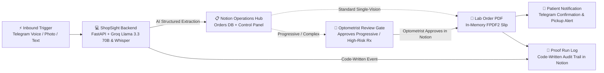

# ShopSight 
### Autonomous Multimodal Order Intake & Notion Human-in-the-Loop Operations Hub

ShopSight is a production-grade automated order intake service for optical clinics and labs. Customers submit orders via Telegram (text messages, voice notes in Hinglish, or photos of prescription slips), Groq AI extracts structured optical parameters, and everything lands in **Notion** where the optometrist reviews, approves, and oversees operations.

---

## 🏛️ System Architecture



---

##  How It Works

1. **Autonomous Intake (24/7)**:
   - A customer sends a voice note, photo, or text (*"Bhai OD -2.00, OS -1.50 single vision blue cut lens chahiye"*) to [@ShopSight_bot](https://t.me/ShopSight_bot).
   - The backend acknowledges immediately via Telegram.

2. **Multilingual AI Extraction (Groq)**:
   - Groq **Whisper Turbo** transcribes voice notes in Hinglish and regional dialects.
   - Groq **Llama 3.3 70B** extracts structured optical parameters (`OD SPH`, `OD CYL`, `OS SPH`, `Lens Type`, `PD`, `Frame`).
   - For photos of handwritten slips, Groq **Llama 3.2 Vision** extracts prescription details.

3. **Notion Human Approval Gate**:
   - Safe, low-value single-vision orders are **Auto-Approved**.
   - Complex progressive lenses, high-cylinder powers, or low-confidence orders pause at the **`Needs Approval` Gate** in Notion with AI reasoning notes.
   - When the optometrist updates the status to `Approved` in Notion, the backend automatically detects the change, generates the vendor lab PDF, and notifies the patient.

4. **Immutable Audit Trail (Run Log)**:
   - Every single lifecycle step (`received`, `extracted`, `auto_approved`, `needs_approval`, `vendor_order_sent`, `customer_notified`, `ready`) writes a code-stamped row with timestamps to the **Notion Run Log DB**.

---

##  Universal Blueprint Architecture

Under the hood, ShopSight uses a modular blueprint engine supporting multiple industry schemas:
*  **Optical Practice (`blueprints/schemas/optical.json`)**: SPH/CYL/AXIS/ADD/PD extraction & progressive gating
*  **Dental Practice (`blueprints/schemas/dental.json`)**: Tooth numbers, shade matching (A1/A2), and restoration materials
*  **Auto Workshop (`blueprints/schemas/auto_repair.json`)**: Vehicle model, reg plate, parts requisition, and overhaul gating
*  **Custom Tailoring (`blueprints/schemas/custom_tailoring.json`)**: Body measurements, fabric code, and cutting tickets

---

##  Quickstart

### 1. Clone & Install Dependencies
```bash
git clone https://github.com/<your-username>/shopsight.git
cd shopsight
pip install -r requirements.txt
```

### 2. Configure Environment (`.env`)
```ini
TELEGRAM_BOT_TOKEN=your_telegram_bot_token_here
ADMIN_CHAT_ID=your_telegram_chat_id
GROQ_API_KEY=your_groq_api_key
NOTION_TOKEN=your_notion_secret_token
NOTION_PARENT_PAGE_ID=your_notion_parent_page_id
```

### 3. Bootstrap Notion Workspace
```bash
python notion_setup/setup_workspace.py
```

### 4. Run Locally
```bash
uvicorn app.main:app --reload --port 8000
```
